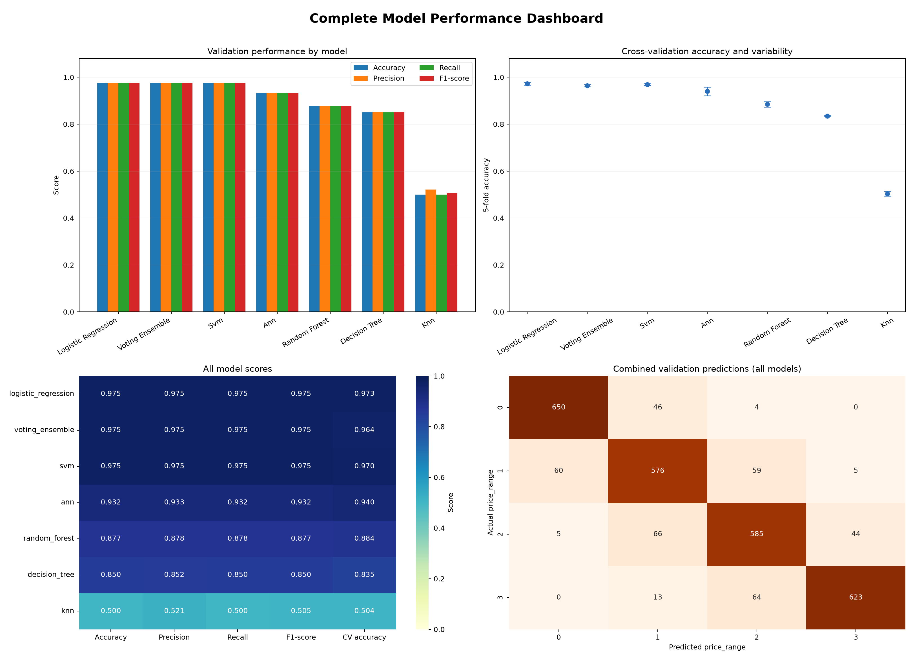
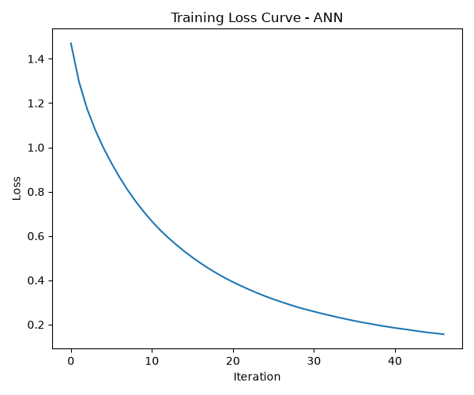
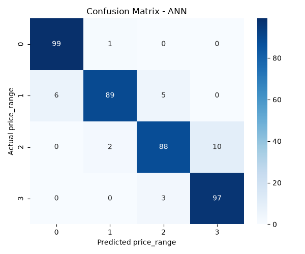

# ann-project
# Mobile Price Prediction

<div align="center">

## An interpretable benchmark of classical machine learning and neural networks

Predict a phone's price tier from its hardware specifications using a scaled
artificial neural network and six benchmark classifiers.


</div>

---

## Overview

This project classifies mobile phones into four price ranges from technical
specifications. It includes:

- A two-hidden-layer ANN built with `sklearn.neural_network.MLPClassifier`
- Six comparison models: Logistic Regression, linear SVM, Decision Tree,
	Random Forest, KNN, and a soft-voting ensemble
- Standardized preprocessing shared by the trained models
- Validation metrics, confusion matrices, loss curves, and comparison dashboards
- CSV predictions for every trained model on the unlabeled test set

The project is designed as an end-to-end machine-learning experiment: prepare
the data, train models, evaluate them fairly, compare their behavior, and save
reusable artifacts.

## Results at a glance

The best validation accuracy is shared by Logistic Regression, linear SVM, and
the voting ensemble. Logistic Regression has the strongest 5-fold cross-validation
mean and is the most consistent choice for this dataset.

| Model | Validation accuracy | 5-fold CV accuracy |
| --- | ---: | ---: |
| Logistic Regression | **97.5%** | **97.3% ± 0.6%** |
| Linear SVM | **97.5%** | 97.0% ± 0.4% |
| Voting Ensemble | **97.5%** | 96.5% ± 0.5% |
| ANN (`tanh`) | 93.3% | 94.0% ± 1.9% |
| Random Forest | 87.8% | 88.5% ± 1.1% |
| Decision Tree | 85.0% | 83.5% ± 0.3% |
| KNN | 50.0% | 50.4% ± 1.0% |

> The results are based on the committed generated artifacts in
> [`ann/results/model_comparison`](ann/results/model_comparison). Re-run the
> training scripts to regenerate them.

## Visual report

<p align="center">
	
</p>

<p align="center">
	
	
</p>

## Dataset

The project uses a mobile-price dataset with 2,000 labeled training rows and
1,000 test rows. The target, `price_range`, has four classes:

| Label | Meaning |
| ---: | --- |
| `0` | Low cost |
| `1` | Medium cost |
| `2` | High cost |
| `3` | Very high cost |

Features describe battery capacity, connectivity, cameras, memory, screen
dimensions, processor cores, weight, talk time, and RAM. The training data
contains the target column; `test.csv` contains an `id` column used to keep
predictions associated with their original rows.

### Preprocessing

1. Load `dataset/train.csv`.
2. Split the labeled data into stratified training and validation sets using an
	 80/20 split and `random_state=42`.
3. Fit a `StandardScaler` on the training features only.
4. Transform validation and test features with the saved scaler.
5. Save the scaler to `models/preprocessing/scaler.pkl`.

The strong relationship between `ram` and `price_range` makes the dataset
particularly favorable to linear classifiers. That is why the tuned linear
models outperform the ANN here; the ANN is included as the central experiment,
not because it is automatically the best model for every dataset.

## Quick start

### 1. Set up the environment

```bash
cd ann
python -m venv .venv
```

Activate the environment:

```bash
# Windows PowerShell
.\.venv\Scripts\Activate.ps1

# macOS/Linux
source .venv/bin/activate
```

Install the dependencies:

```bash
python -m pip install -r requirements.txt
```

### 2. Train the ANN

```bash
python train.py
```

This trains the `MLPClassifier`, prints validation metrics, and writes the ANN
model, metrics CSV, confusion matrix, loss curve, and metrics summary.

### 3. Compare all models

```bash
python compare_models.py
```

This trains every classifier, computes validation metrics and 5-fold
cross-validation accuracy, saves each model, generates comparison charts, and
creates test predictions.

### 4. Predict with one saved model

The selected model must already have been trained by `compare_models.py`:

```bash
python predict_model.py --model logistic_regression
```

Available model names are `ann`, `logistic_regression`, `decision_tree`,
`random_forest`, `svm`, `knn`, and `voting_ensemble`.

### Optional: show the ANN training demonstration

```bash
python train_demo.py
```

This runs the same ANN training flow with verbose iteration output.

## Project structure

```text
ann-project/
├── ann/
│   ├── dataset/
│   │   ├── train.csv                 # Labeled training data
│   │   └── test.csv                  # Unlabeled prediction data
│   ├── models/
│   │   ├── ann/model.pkl             # Trained ANN
│   │   ├── benchmarks/<model>/       # Saved comparison models
│   │   └── preprocessing/scaler.pkl  # Shared fitted scaler
│   ├── results/
│   │   ├── ann/                      # ANN metrics and graphs
│   │   ├── model_comparison/         # Benchmark tables and dashboards
│   │   └── predictions/              # Per-model test predictions
│   ├── compare_models.py             # Train and compare all classifiers
│   ├── predict_model.py              # Predict with a saved classifier
│   ├── train.py                      # Train and evaluate the ANN
│   ├── train_demo.py                 # Verbose ANN demonstration
│   ├── utils.py                      # Loading and scaling helpers
│   └── requirements.txt
└── README.md
```

## Output artifacts

| Path | Contents |
| --- | --- |
| `ann/models/` | Serialized models and the fitted preprocessing scaler |
| `ann/results/ann/metrics.csv` | ANN accuracy, precision, recall, and F1 score |
| `ann/results/ann/graphs/` | ANN confusion matrix, loss curve, and metric summary |
| `ann/results/model_comparison/metrics_comparison.csv` | All model metrics and CV scores |
| `ann/results/model_comparison/performance_dashboard.png` | Visual model comparison |
| `ann/results/predictions/<model>/predictions.csv` | Test IDs and predicted price ranges |

## Evaluation notes

Accuracy, macro precision, macro recall, and macro F1 are used because this is
a four-class classification problem. R² is not appropriate here. The 5-fold
cross-validation score is included to check that the headline validation result
is not only the product of one favorable split.

## Further reading

The implementation-level notes and original experiment write-up are available
in [`ann/README.md`](ann/README.md).

## License

No license has been specified for this repository yet. Add a license before
redistributing the code or dataset.
